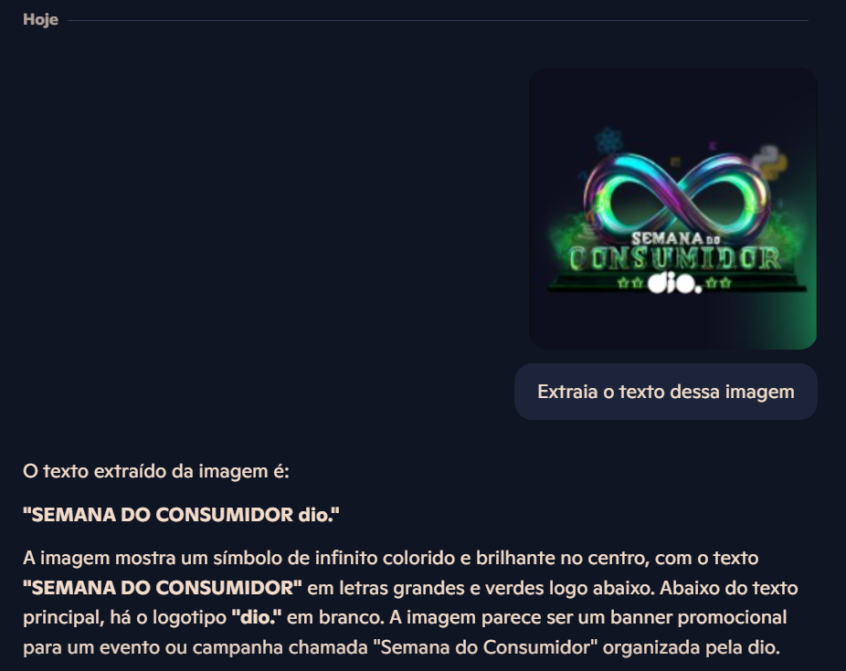
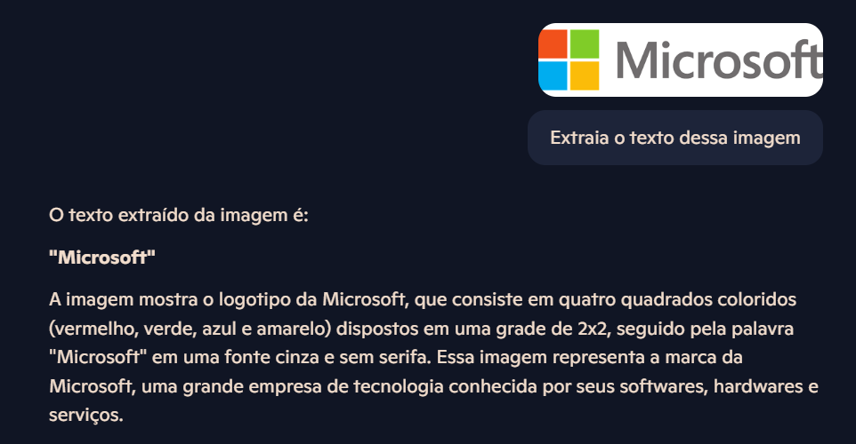

# Explorando os Recursos de IA Generativa com Copilot e OpenAI

## Objetivo

Este repositório contém os resultados e aprendizados obtidos na aula **"Explorando os Recursos de IA Generativa com Copilot e OpenAI"**, cujo objetivo foi utilizar IA Generativa para:

- Realizar a extração de texto a partir de uma imagem enviada.

---

## Resumo

Durante a aula, exploramos como ferramentas de IA Generativa, como o Copilot e OpenAI, podem ser aplicadas em cenários reais de análise e interpretação de imagens. A proposta foi utilizar imagens contendo textos e testar a capacidade da IA em:

- Identificar e extrair o conteúdo textual presente.

Esse exercício demonstrou a flexibilidade e poder criativo da IA Generativa, além de ressaltar seu potencial em automação de tarefas como transcrição, resumo e criação de conteúdo.

---

## Cenários de Teste

**Entrada (Prompt enviado à IA)**  
`Extraia o texto dessa imagem`  

**Saída (Resposta da IA)**  
**Palavras Extraídas:**  
`SEMANA DO CONSUMIDOR dio.`

**Texto Gerado:**  
A imagem mostra um símbolo de infinito colorido e brilhante no centro, com o texto "SEMANA DO CONSUMIDOR" em letras grandes e verdes logo abaixo. Abaixo do texto principal, há o logotipo "dio." em branco. A imagem parece ser um banner promocional para um evento ou campanha chamada "Semana do Consumidor" organizada pela dio.”

---

**Entrada (Prompt enviado à IA)**  
`Extraia o texto dessa imagem`  

**Saída (Resposta da IA)**  
**Palavras Extraídas:**  
`Microsoft`

**Texto Gerado:**  
“A imagem mostra o logotipo da Microsoft, que consiste em quatro quadrados coloridos (vermelho, verde, azul e amarelo) dispostos em uma grade de 2x2, seguido pela palavra "Microsoft" em uma fonte cinza e sem serifa. Essa imagem representa a marca da Microsoft, uma grande empresa de tecnologia conhecida por seus softwares, hardwares e serviços.”

---

## Aprendizados Adquiridos

- **Flexibilidade da IA Generativa:** Percebi como a IA é capaz de adaptar suas respostas de acordo com o contexto fornecido, podendo tanto atuar como assistente técnico quanto como criador de conteúdo.
- **Precisão na Extração de Texto:** Mesmo em imagens com baixa qualidade, a IA mostrou boa capacidade de identificar e transcrever o conteúdo textual presente.
- **Geração Criativa de Conteúdo:** A habilidade de criar textos contextualizados a partir de poucos elementos foi um ponto de destaque, demonstrando o valor da IA em automação criativa.
- **Possibilidades Práticas:** Essas funcionalidades podem ser integradas em sistemas de análise de mídias sociais, automação de atendimento ao cliente, geração de conteúdos de marketing, entre outros.

---

## Repositório

Este repositório contém o resumo da aula e os exemplos testados, servindo como registro prático e material de consulta para futuros projetos envolvendo IA Generativa.
